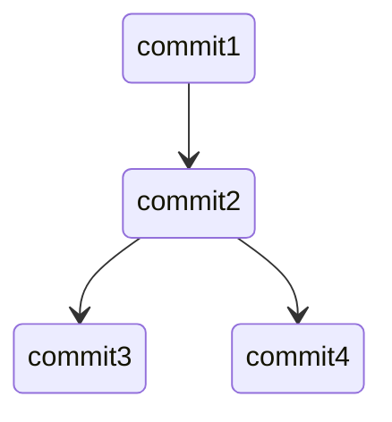

<h3>Git Tutorial</h3> <h4><a style="color:Cyan";>Polo</a></h4>


<h5>Version Control System (VCS)</h5>

Assume you have a folder. Inside you have lots of files and sub-folders. We call the version of this folder 1.1. Three days later, you make some changes to this folder, it's version 1.2. However, you suddenly find there are some errors in this new version, you want that version 1.1 back, but you've already changed it. However, with `VCS`, you can. 

<h5>Local and Remote Repo</h5>

You open a folder named `LoveGit` and use command

```bash
git init
```

Then git controls this folder and turn it into a `repo` (short for repository). As long as you `commit` (you will learn about 'commit' later), repo will record it. For example, you commit your version 1.1, git adds commit 1 in your repo. Then three days later, you commit version 1.2, git add commit 2. Then you commit version 1.3, git add commit 3. However, you find that your version 1.3 is a piece of trash, you want to do your further work based on version 1.2. Nevermind, you go back to commit 2(use command `git checkout`, you will learn all these commands later in the `Second Step`), and develop version 1.4 then commit, git adds commit 4 in your repo.   



So as you can see, repo is a concept, you can represent it in the form of a `Tree` just like above. But what's the content of your folder `LoveGit` ? Actually, after git init, the content of your folder is `working directory`, you will learn it in `First Step`, for now, just keep in mind, repo != folder.

<h5>Git: a distributed VCS</h5>

Centralized VCS records every user's every repo in one server. While `Distrubuted` VCS stores every repo in your own computer, we call them local repos. But what if user 1 wants share his own repo with others? Here comes `Github`! User 1 can create a remote repo on Github, and other user can `clone` that repo on their computers and make it a local repo. If user 2 also wanna make contributions to that remote repo. He can ask user 1 to add user 2 in the contributor list. 


Here are steps for you to learn Git. Finish them in order.

<h4>First Step</h4>

Learn `What is Git`, especially `the three status` part

[What is Git](https://git-scm.com/book/en/v2/Getting-Started-What-is-Git%3F)


<h4>Second Step</h4>

Open `Git Branch` and finish every level inside. In this website, a tree is a repo, and every node represents a `commit`. Just like the above diagram. Learn all the commands, especially, what do they do. The animation of diagram will help you a lot.

[GIt Branch](https://learngitbranching.js.org/)


<h4>Third Step</h4>

Install a Git and use it. you need to notice that the things in `git branch` is slightly different from the real git. 

For example

* you can't see the clear diagram anymore, so you have to get the diagram in your mind. 

* Also, there is a case when your local repo conflicts with remote repo. Assume now you fetch and pull the remote repo

  ```mermaid
  stateDiagram-v2
  commit1 --> commit2
  ```

  and you open the file test.py and change the code in the 92th line. But before you commit and push it, another contributor also make changes to the same line test.py and commit, push it to the remote repo, which means: the present remote repo is ahead of you!

  ```mermaid
  stateDiagram-v2
  state presentRemote{
  	commit3
  }
  state presentLocal{
  	commit4
  }
  commit1 --> commit2
  commit2 --> presentRemote
  commit2 --> presentLocal
  ```

  And unfortunately, you and commit3 change the same position of the same file, so you can't directly merge or rebase, because git don't know which one should be used. This is called a conflict, different editor (or IDE) highlight differently about the conflicts (Visual Studio Code did it so well) and you should check details on Google.

* When you first add a branch and push it to remote repo, the commands will be slightly different.

And so on, learn them on google or youtube if you meet these real cases that you don't know.

Git has a nice prompt system. When errors occur, usually, git will tell you the right way. 

You can also ask me if you want.

