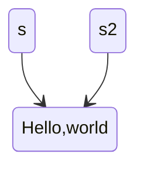

```c
int *const i; //can't change the value of i, aka the address that i saves
const int *i; //can't change value of the destination through pointer i
```

To store a string

```c
char *s = "Hello, world"
char *s2 = "Hello, world"
printf("%p",s) // Instead of printf("%p",*s)
```

