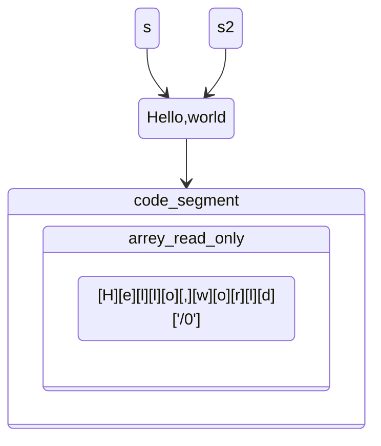

<h5>Constant pointer
    
</h5>

```c
int *const i; //can't change the value of i, aka the address that i saves
const int *i; //can't change value of the destination through pointer i
```


##### To store a string

```c
char *s = "Hello, world";
char *s2 = "Hello, world";
printf("%s",s); // Instead of printf("%s",*s)
```



String will be stored in code segment  if using this way, and that is read-only

```c
char s3[] = "Hello, world";
```

String will be stored locally if we define this way, and it is writable.

##### Input and output of a string

```c
char string[8];
scanf("%7s", string);// Use %7s to clarify the largest size of this string
```

